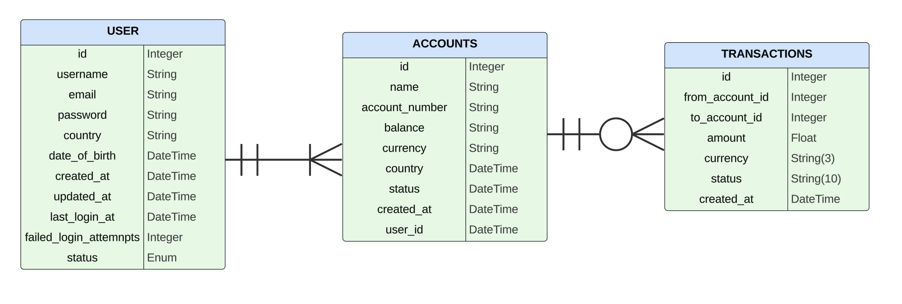
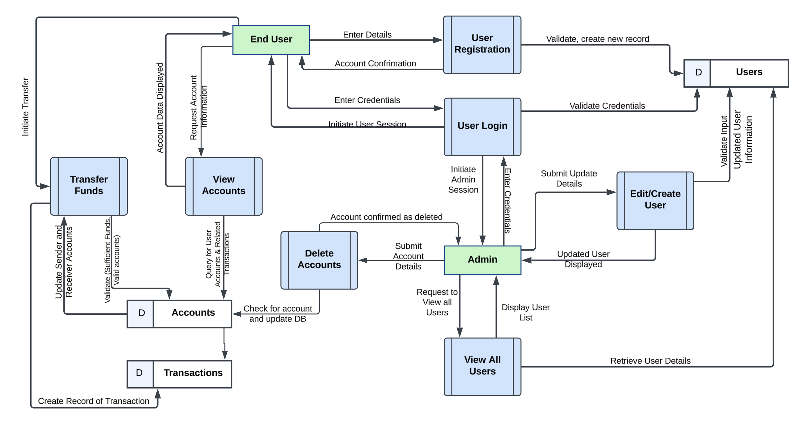

# Cloud Architect Documentation

Welcome to the Cloud Architect's section of the IE BANK documentation. Below you will find the key sections that describe the architecture, environment design, frameworks, and various models essential for the cloud infrastructure of IE BANK.

## Table of Contents
- [Infrastructure Architecture Design](#infrastructure-architecture-design)
- [Environments Design](#environments-design)
- [Well Architected Framework Design](#well-architected-framework-design)
- [Release Strategy](#release-strategy)
- [Use Case and Sequential Model Diagrams](#use-case-and-sequential-model-diagrams)
- [Entity Relationship Diagram](#entity-relationship-diagram)
- [Data Flow Diagram](#data-flow-diagram)
- [12 Factor App Design](#12-factor-app-design)

---

## Infrastructure Architecture Design

The infrastructure for the IE Bank MVP has been carefully designed to ensure scalability, security, and cost-effectiveness while meeting the functional and non-functional requirements of the application. We have adopted a cloud-native approach, leveraging Microsoft Azure services to create a robust DTAP (Development, Testing, Acceptance, Production) environment strategy. This design aligns with industry best practices and the Azure Well-Architected Framework.

### Key Azure Services and Architecture Components
1. **Frontend Hosting** : **Azure Static Web Apps:**
  - A lightweight and cost-effective service to host the Vue.js frontend.
  - Provides automatic CI/CD integration via GitHub Actions
  - Enables global scalability and quick deployment.
2. **Backend Hosting**: **Azure App Service**
  - Hosts A Flask Python application as a containarized service. 
  - Proivides seamless scalling, reliability, and integration with Azure monitoring tools.
3. **Database: Azure Database for PostreSQL**
  - A managed relational database service chosen for secure and scalable data storage.
  - Utilizes Flexible Server mode for optimal cost and performance.
4. **Container Management: Azure Container Registry (ACR):**
  - Hosts Docker container images for backend services
  - Integrated with Key Vault for secure credential management.
5. **Secrets Management: Azure Key Vault**
  - Ensures secure storage of secrets like PostgreSQL credentials and ACR authentication keys.
  - Integrated with the backend and deployment pipelines for automated secret retrieval.
6. **Monitoring and Logging: Azure Alerts, Application Insights and Log Analytics Workspace**
  - Log collection and metric analysis for infrastructure and application layers on Azure Workbooks.
  - Azure Application Insights: Provides in-depth performance monitoring and telemetry for the frontend and backend. //ASK EDU

### Environment Setup: DTAP Approach
We have implemented a **DTAP** (Development, Testing, Acceptance, Production) environment strategy to ensure isolated and controlled stages for the application lifecycle.
1. **Development Environment:**
  - Deployed in a dedicated Azure Resource Group (BCSAI2024-DEVOPS-STUDENTS-A-DEV).
  - Accessible to the team for experimentation and feature development.
  - Configured for real-time CI/CD deployments triggered by feature branch commits.
2. **Testing Environment:**
  - Integrated with the UAT Resource Group(BCSAI2024-DEVOPS-STUDENTS-A-UAT).
  - Facilitates automated functional tests via GitHub Actions.
  - Simulates production workloads for stakeholder demonstrations.
3. **Production Environment:**
  - Hosted in a Production Resource Group (BCSAI2024-DEVOPS-STUDENTS-A-PROD).
  - Configured for high availability and optimal performance for end-users.
  - Deployments occur only after successful tests in UAT.

### Infrastructure-as-Code (IaC)
The infrastructure is defined using **Azure Bicep**, a modular IaC approach that simplifies deployment and management.
1. **Modularization:**
 - Each Azure service (e.g., App Service, PostgreSQL, Key Vault) is defined as an independent Bicep module.
 - These modules are reusable and parameterized to support the DTAP environment strategy.
2. **Main Bicep File:**
  - Acts as the orchestrator for deploying all modules.
  - Environment-specific configurations (e.g., database tiers, region settings) are handled via parameter files.
3. **Parameter Files:**
- Separate parameter files for Development, UAT, and Production.
- Enables consistent deployment across all environments with minimal changes.

---

## Environments Design

### Overview

The environment design ensures a structured and consistent approach to deploying and managing the IE Bank application across its lifecycle. By adopting the **DTAP (Development, Testing, Acceptance, Production)** strategy, we maintain clear boundaries between environments, enabling controlled deployments, thorough testing, and high confidence in production stability. Each environment is configured to reflect its unique purpose, from experimentation in Development to secure and optimized setups in Production.

---

### DTAP Environments and Configurations

Each environment is deployed within its respective Azure Resource Group, with configurations tailored to its specific role. Below are the key characteristics and services for each environment:

**1. Development Environment**
- **Purpose**: For developers to experiment, implement, and validate features.
- **Resource Group**: `BCSAI2024-DEVOPS-STUDENTS-A-DEV`
- **Services**:
  - **Azure Static Web Apps**: Hosts the frontend for feature testing.
  - **Azure App Service**: Runs the containerized backend with frequent updates.
  - **Azure Database for PostgreSQL**: Basic configuration for cost-effectiveness.
  - **Azure Key Vault**: Stores secrets (e.g., database credentials).
  - **Azure App Insights and Log Analytics**: Tracks performance metrics and logs during development.
- **Deployment**:
  - Triggered by GitHub feature branch commits using CI pipelines.
  - Frequent deployments ensure real-time validation of new code.

---

**2. Testing/UAT Environment**
- **Purpose**: Facilitates functional, integration, and acceptance testing.
- **Resource Group**: `BCSAI2024-DEVOPS-STUDENTS-A-UAT`
- **Services**:
  - **Azure Static Web Apps**: Hosts a near-production frontend for stakeholder previews.
  - **Azure App Service**: Deploys a stable backend container for testing.
  - **Azure Database for PostgreSQL**: Uses a configuration that mirrors production settings.
  - **Azure Key Vault**: Securely stores credentials for the UAT setup.
  - **Azure App Insights and Log Analytics**: Captures logs and metrics for test validation. Collects telemetry for backend/frontend performance testing.
- **Deployment**:
  - Triggered by Pull Requests to the main branch.  
  - Tests are executed as GitHub status checks, and only passing tests allow a merge.

---

**3. Production Environment**
- **Purpose**: Serves the live application to end-users with high reliability and performance.
- **Resource Group**: `BCSAI2024-DEVOPS-STUDENTS-A-PROD`
- **Services**:
  - **Azure Static Web Apps**: Fully optimized for end-user traffic.
  - **Azure App Service**: Scaled container backend for reliability under high loads.
  - **Azure Database for PostgreSQL**: High-availability configuration with backups.
  - **Azure Key Vault**: Enforces stringent access policies for secrets management.
  - **Azure App Insights and Log Analytics Workspace**: Provides centralized logging and alerting. Monitors application health, latency, and errors in real time.
- **Deployment**:
  - Triggered by merging successfully tested code from UAT.
  - Deployment follows automated CI/CD workflows with rollback capabilities.

---

### Configuration Differentiation

Environment-specific configurations are managed through Azure Bicep parameter files. These parameter files ensure consistency in deployment while allowing flexibility for each environment's unique needs.

| **Service**         | **Development**          | **UAT**                         | **Production**                     |
|----------------------|--------------------------|----------------------------------|-------------------------------------|
| **App Service Plan** | Basic Tier               | Basic Tier                        | Basic Tier                     |
| **PostgreSQL DB**    | Single Zone              | Single Zone with Backups        | Single Zone with Backups        |
| **Key Vault Policies** | Developer Access      | Limited Stakeholder Access       | Restricted Production Access       |
| **Scaling Rules**    | Manual Scaling          | Auto-Scaling with Alerts           | Auto-Scaling with Redundancy       |
| **Monitoring**       | Full Monitoring + Alerts  | Full Monitoring + Alerts               | Full Monitoring + Alerts           |

---

### CI/CD Integration Across Environments

- **Development**: 
  - Feature branch commits automatically trigger builds and deploy to the Development environment.
- **UAT**:
  - Pull requests trigger test workflows and deploy to UAT for approval.
- **Production**:
  - Merges to the main branch trigger deployments to Production after passing all automated checks.

---

### Security and Isolation

- Each environment operates in its own Azure Resource Group, ensuring isolation.
- Access policies vary across environments, with stricter controls in UAT and Production.
- Secrets are stored securely in Azure Key Vault, with automated rotation and limited access per environment.

---

### Benefits of the DTAP Approach

- **Consistency**: Ensures repeatable and predictable deployments.
- **Reduced Risk**: Isolated environments prevent testing or development issues from affecting Production.
- **Scalability**: Enables gradual scaling and tuning as code progresses from Development to Production.
- **Stakeholder Confidence**: UAT provides a near-live preview of features before deployment.

---

### Summary

The DTAP environment strategy ensures a robust and methodical deployment process, minimizing risks and maximizing quality. By maintaining environment-specific configurations and leveraging Azure's cloud capabilities, the IE Bank MVP is poised for secure and seamless operations at every stage.

---

## Well Architected Framework Design

The design of the IE Bank application leverages the Microsoft Azure Well-Architected Framework to ensure it meets high standards of reliability, security, performance, cost efficiency, and operational excellence. Each design decision has been carefully evaluated to address both functional and non-functional requirements while ensuring scalability and resilience.

### 1. Reliability

Reliability is critical to ensure the IE Bank MVP performs its intended functions without failure, especially in Production.

**Design Features:**
- **Azure App Service Plan**:
  - Uses a zone-redundant configuration for high availability in Production.
  - Autoscaling enabled based on CPU and memory utilization to handle peak loads.
- **Azure Database for PostgreSQL**:
  - Configured in zone-redundant mode for fault tolerance.
  - Automatic backups with point-in-time recovery enabled.
- **Monitoring and Alerts**:
  - Log analytics provide real-time insights into application performance.
  - Alerts notify teams of potential issues, enabling swift remediation.

### 2. Security

Security ensures the protection of sensitive data, such as user credentials and financial transactions.

**Design Features:**
- **Azure Key Vault**:
  - Manages secrets, connection strings, and sensitive credentials.
  - Integrated with App Services and GitHub workflows for secure CI/CD pipelines.
- **GitHub Advanced Security**:
  - CodeQL scans for vulnerabilities in backend (Python) and frontend (Vue.js).
  - Dependabot keeps dependencies up-to-date, reducing exposure to known vulnerabilities.
- **Encryption**:
  - Sensitive data is hashed appropriatley in the frontend and the backend, and never stored in plain text.
  - Data in transit uses HTTPS and TLS for frontend-backend communication.

### 3. Cost Optimization

Cost optimization ensures efficient use of Azure resources while maintaining performance and reliability.

**Design Features:**
- **Resource Scaling**:
  - Development and UAT environments use lower-cost service tiers.
  - Production leverages autoscaling to adjust resource usage based on traffic demands. <!-- we need to configure this  -->

- **Static Web Hosting**:
  - Vue.js frontend is hosted on Azure Static Web Apps, minimizing hosting costs.
- **Efficient Resource Utilization**:
  - Consolidated logging and monitoring using a single Log Analytics Workspace.

### 4. Performance Efficiency

Performance efficiency ensures the application can handle current and future workloads effectively.

**Design Features:**
- **Azure App Service Plan**:
  - Configured for autoscaling based on CPU and memory utilization.
  - Optimized for container workloads with Linux App Services.
- **Azure Database for PostgreSQL**:
  - Uses optimized query execution plans and indexing to reduce latency.
- **Application Insights**:
  - Tracks application performance metrics (e.g., response times, request rates).
  - Identifies bottlenecks in real-time for both frontend and backend.

### 5. Operational Excellence

Operational excellence ensures smooth application deployment and maintenance, minimizing downtime and maximizing development productivity.

**Design Features:**
- **CI/CD Pipelines**:
  - GitHub Actions automate deployments across Development, UAT, and Production.
  - Includes tests for code quality, security, and functionality.
- **Infrastructure as Code (IaC)**:
  - Bicep templates modularize and automate resource provisioning.
- **Monitoring and Incident Response**:
  - Application Insights provide real-time visibility.
  - Alerts integrated with Slack via ChatOps for rapid incident response.

### Design Tradeoffs

Some design decisions involve tradeoffs to balance between the framework pillars:
- **Cost vs. Reliability**:
  - UAT and Production environments prioritize reliability with higher-tier resources.
  - Development uses cost-effective options like basic-tier PostgreSQL and App Services.
- **Performance vs. Cost**:
  - Autoscaling ensures optimal performance during peak loads, but may incur additional costs.

### Unnadressed Pillar - Sustainability 
**Why Not Addressed?**
Sustainability was not a primary focus during the MVP phase, as the project prioritized performance, security, and cost management. The effort required to evaluate and optimize environmental impact will be deferred to later stages.

**Future Plans:**
- Incorporate tools like Azure Sustainability Calculator to evaluate the carbon footprint of the application.
- Optimize resource usage further, such as reducing idle resource consumption in non-production environments and leveraging green regions where available.

### Summary

The IE Bank application infrastructure adheres to the Azure Well-Architected Framework, ensuring a secure, reliable, and efficient system. By leveraging Azure's robust services and best practices, the design supports scalability, performance, and operational excellence, meeting both current needs and future growth.

---

## Release Strategy

This release strategy ensures that all deployments across Development, UAT, and Production environments are executed securely, reliably, and efficiently. It integrates environment-specific designs, aligns with the DevOps Checklist from Azure Architecture Center, and incorporates best practices from DevSecOps with GitHub Security.

### Environment Design in the Release Strategy
The release strategy follows our **DTAP (Development, Testing, Acceptance, Production)** approach, ensuring isolated and purpose-driven environments. Each environment plays a specific role in the lifecycle:

**Development Environment**
- **Purpose**: Active development, experimentation, and unit testing.
- **Configuration**:
  - Lightweight App Service plans and database tiers to reduce costs.
  - Integration with feature branch CI pipelines.
- **Deployment Trigger**: Commits to feature branches.

**UAT Environment**
- **Purpose**: Validation of functionality, stakeholder feedback, and pre-production testing.
- **Configuration**:
  - Closer parity with Production, including App Service scaling and database settings.
  - Automated functional tests and manual QA processes.
- **Deployment Trigger**: Pull Requests (PRs) to the main branch.

**Production Environment**
- **Purpose**: Final live environment for end-users.
- **Configuration**:
  - High-availability services and redundancy (e.g., zone-redundant PostgreSQL).
  - Secure configurations and monitoring (Key Vault, Azure Monitor).
- **Deployment Trigger**: Successful tests in UAT and approved PRs merged into the main branch.

### Decisions Based on the DevOps Checklist

The **DevOps Checklist** from the Azure Architecture Center has been reviewed and incorporated to ensure best practices in the release strategy:

**Source Control**
- All code, including IaC, is stored in GitHub repositories.
- Feature branching with branch policies (e.g., PR reviews, status checks).

**Continuous Integration/Delivery**
- Automated CI pipelines for building, testing, and deploying applications.
- Continuous Delivery pipelines configured with environment-specific gates:
  - Feature branches → Development
  - PRs → UAT
  - Main branch merges → Production

**Testing**
- **Unit tests**: `pytest` for backend, Postman for APIs in CI workflows.
- **Automated functional tests**: Required for UAT deployments as status checks.
- **Deployment strategies**: Canary or blue-green strategies for critical Production updates. //FIX LATER

**Infrastructure as Code (IaC)**
- Infrastructure modularized using Azure Bicep.
- Parameterized templates for environment-specific configurations.

**Monitoring and Logging**
- Centralized logging with Log Analytics Workspace.
- Alerts and dashboards configured for proactive issue detection.

### Review and Decisions Based on DevSecOps with GitHub Security

The **DevSecOps best practices** from Azure Architecture Center and GitHub Security are integrated into the release strategy to secure the pipeline and application:

**GitHub Security Features**
- **CodeQL**: Automated code scanning for vulnerabilities in backend (Python) and frontend (Vue.js).
- **Dependabot**: Monitors and updates dependencies to patch known vulnerabilities.
- **Secret Scanning**: Prevents sensitive information like API keys from being committed.
- **Push Protection**: Blocks the addition of secrets to the repository.

**Infrastructure Security**
- Secrets (e.g., PostgreSQL credentials) managed via Azure Key Vault.
- App Service and database configured with strict access controls and encrypted connections.

**CI/CD Pipeline Security**
- GitHub branch protection policies enforce PR reviews, status checks, and passing tests before merging.
- Deployment credentials stored securely in Key Vault and retrieved dynamically during builds.
- Least privilege access for pipeline Service Principal (SP) accounts.

**Application Security**
- End-to-end encryption for data at rest (Azure-managed keys) and in transit (HTTPS/TLS).
- Role-based access control (RBAC) ensures proper permissions in Azure environments.

### Updated Deployment Workflow

This release strategy incorporates secure and efficient deployment workflows:

**Development**
- Linting, building, and unit tests on every commit.
- Immediate deployment to Development.

**UAT**
- Triggered by PR creation.
- Automated functional tests must pass to proceed.

**Production**
- Final deployment triggered by merging a PR.
- Production monitoring activated to verify deployment success.

### Summary

The updated release strategy tightly integrates secure, efficient, and scalable practices while aligning with the Azure DevOps Checklist and DevSecOps principles. This approach ensures that every release is not only functional but also secure, robust, and auditable, minimizing risks while maximizing delivery speed and confidence.

---

## Use Case and Sequential Model Diagrams

This section includes the diagrams for each use case and sequential models to illustrate the flow of data and interactions within the system.

- **Use Case Diagrams**: [Use Case Diagrams URL]
- **Sequential Model Diagrams**: [Sequential Model Diagrams URL]

---

## Entity Relationship Diagram

The Entity Relationship Diagram (ERD) describes the database schema and how the entities in the database are related to each other.

- **Entity Relationship Diagram**: 

---

## Data Flow Diagram

The Data Flow Diagram (DFD) visualizes how data moves through the system, showing inputs, outputs, data processes, and storage points.

- **Data Flow Diagram**:

---

## 12 Factor App Design

### Overview

The 12-Factor App methodology provides a set of best practices for building modern, scalable, and maintainable cloud-native applications. The IE Bank MVP adheres to these principles to ensure reliability, scalability, and ease of deployment across environments. Below is how each of the 12 factors is applied in the design and implementation of the product.

---

### 1. Codebase
**A single codebase tracked in version control, with multiple deployments.**  
**Implementation**:
- 2 GitHub repositories contains the code for the frontend (Vue.js), backend (Python Flask).
- Modular infrastructure code is stored in the a separate repository, leveraging Azure Bicep.
- **Branching strategy**: Feature branches for development; main for production.

---

### 2. Dependencies
**Explicitly declare and isolate dependencies.**  
**Implementation**:
- Backend dependencies are managed with `pip` and `requirements.txt`.
- Frontend dependencies are managed with `npm` and `package.json`.
- Containers ensure isolated environments, with images built using Docker.

---

### 3. Configuration
**Store configuration in the environment, not in the code.**  
**Implementation**:
- Sensitive credentials (e.g., database connections, API keys) are stored in Azure Key Vault.
- Environment-specific configurations are handled via Bicep parameter files.
- Application settings (e.g., UAT vs. Production) are managed using Azure App Service settings.

---

### 4. Backing Services
**Treat backing services (e.g., databases, queues) as attached resources.**  
**Implementation**:
- The PostgreSQL database is provisioned as a managed Azure resource.
- Secrets for database and other external services are integrated through Key Vault.
- Backend services connect dynamically to resources based on the environment.

---

### 5. Build, Release, Run
**Separate the build and run stages for deployment.**  
**Implementation**:
- **Build**: CI pipelines build Docker images for the backend and frontend.
- **Release**: Release artifacts are deployed to UAT for validation.
- **Run**: After validation, production deployments are triggered automatically.

---

### 6. Processes
**Execute the app as one or more stateless processes.**  
**Implementation**:
- The backend is stateless and scalable, with session data stored in the database.
- Frontend interactions rely on APIs for dynamic data, with no local storage of state.

---

### 7. Port Binding
**Expose services via port binding.**  
**Implementation**:
- Backend runs on a containerized App Service, exposing an HTTP endpoint.
- Azure Static Web Apps serve the frontend, communicating with the backend via RESTful APIs.

---

### 8. Concurrency
**Scale out via the process model.**  
**Implementation**:
- Autoscaling is enabled for the App Service and PostgreSQL database in Production.
- Azure's built-in load balancer supports concurrent requests without manual configuration.

---

### 9. Disposability
**Maximize robustness with fast startup and graceful shutdown.**  
**Implementation**:
- Containers ensure consistent and fast startups.

---

### 10. Dev/Prod Parity
**Keep development, staging, and production as similar as possible.**  
**Implementation**:
- DTAP environments are provisioned using the same Bicep templates for consistency.
- Azure Monitor and Application Insights provide similar telemetry in all environments.

---

### 11. Logs
**Treat logs as event streams.**  
**Implementation**:
- Application and infrastructure logs are centralized in Log Analytics Workspace.
- Application Insights captures performance and error telemetry for both frontend and backend. // fix everwhere that syas azure mionitor

---

### 12. Admin Processes
**Run admin/management tasks as one-off processes.**  
**Implementation**:
- Database migrations are executed as one-off commands in the CI/CD pipeline.
- Monitoring and incident responses leverage Azure CLI and automated scripts.

---

### Benefits for IE Bank MVP

- **Scalability**: The 12-Factor methodology supports horizontal scaling and seamless environment transitions.
- **Maintainability**: Clear separation of concerns simplifies debugging and onboarding.
- **Resilience**: Decoupling of services and statelessness ensures robust failover mechanisms.

---

### Summary

By aligning with the 12-Factor App principles, the IE Bank MVP achieves a cloud-native design optimized for modern application development. This foundation ensures the application is scalable, maintainable, and well-suited for continuous integration and delivery.

---

Feel free to explore each section for detailed documentation.

 
  <a href="product_owner.html">Previous</a>

  <a href="index.html">Back to home</a>

  <a href="full_stack_developers.html">Next</a>

