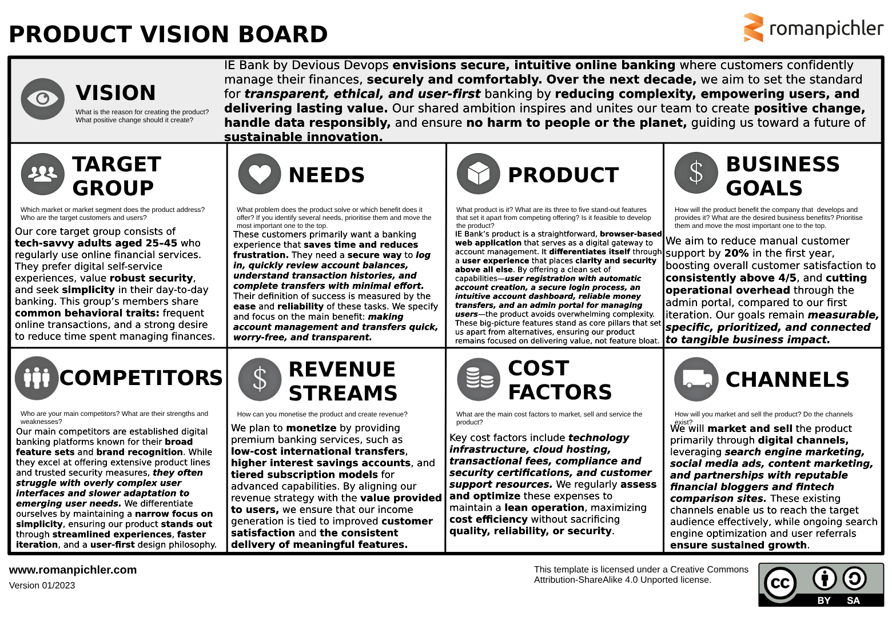

# Product Owner Documentation

Welcome to the Product Owner's section of the IE BANK documentation. Below you will find the key sections that describe the responsibilities, vision, and strategy that guide the product development process.

## Table of Contents
- [Product Vision & Mission Statements](#product-vision--mission-statements)
- [Product Vision Board](#product-vision-board)
- [Minimum Viable Product (MVP) and Requirements](#minimum-viable-product-mvp-and-requirements)
- [Objectives and Key Results (OKRs)](#objectives-and-key-results-okrs)
- [Scrum Methodology](#scrum-methodology)
- [Collaboration Strategy](#collaboration-strategy)

---

## Product Vision & Mission Statements

The Product Owner is responsible for articulating the vision and mission of the IE BANK product. These statements are key to aligning the team and stakeholders with the long-term goals and purpose of the product.

- **Product Vision**: Our product envisions a secure, transparent, and intuitive digital banking ecosystem that empowers users to take control of their financial health effortlessly. Over the next five to ten years, we aim to become the trusted standard in ethical, user-first banking, delivering meaningful value through simple, accessible experiences that make everyday financial management seamless, confident, and positive.
- **Product Mission**: Our mission is to create and continuously refine a focused, outcome-based web application that streamlines banking operations for both customers and administrators. By prioritizing user needs, ensuring responsible data handling, offering big-picture capabilities—from secure login and intuitive account management to transparent money transfers and efficient user administration—we commit to delivering measurable improvements in user satisfaction, operational efficiency, and business growth. Through regular validation, adaptive planning, and shared understanding among all stakeholders, we strive to maintain a living vision that stays connected to user outcomes, validates assumptions, and drives sustainable success.

---

## Product Vision Board

The Product Vision Board provides a clear and concise visualization of the product's goals, market, and customers.

- **Vision**:
  IE Bank by Devious Devops **envisions secure, intuitive online banking** where customers confidently manage their finances, **securely and comfortably. Over the next decade,** we aim to set the standard for **transparent, ethical, and user-first** banking by **reducing complexity, empowering users, and delivering lasting value.** Our shared ambition inspires and unites our team to create **positive change,** **handle data responsibly,** and ensure **no harm to people or the planet,** guiding us toward a future of **sustainable innovation.**

- **Target Group**:
  Our core target group consists of **tech-savvy adults aged 25-45** who regularly use online financial services. They prefer **digital self-service** experiences, value **robust security,** and seek **simplicity** in their day-to-day banking. This group's members share **common behavioral traits:** frequent online transactions, and a strong desire to reduce time spent managing finances.

- **Needs**:
  These customers primarily want a banking experience that **saves time and reduces frustration.** They need a **secure way to log in, quickly review account balances, understand transaction histories, and complete transfers with minimal effort.** Their definition of success is measured by the **ease and reliability** of these tasks. We specify and focus on the main benefit: **making account management and transfers quick, worry-free, and transparent.**

- **Product**:
  IE Bank's product is a straightforward, **browser-based web application** that serves as a digital gateway to account management. It **differentiates itself** through a **user experience** that places **clarity and security above all else.** By offering a clean set of capabilities—**user registration with automatic account creation, a secure login process, an intuitive account dashboard, reliable money transfers, and an admin portal for managing users**—the product avoids overwhelming complexity. These big-picture features stand as core pillars that set us apart from alternatives, ensuring our product remains focused on **delivering value**, not feature bloat.

- **Business Goals**:
  We aim to reduce manual customer support by **20%** in the first year, boosting overall customer satisfaction to consistently **above 4/5,** and cutting **operational overhead** through the admin portal, compared to our first iteration. Our goals remain **measurable, specific, prioritized, and connected to tangible business impact.**

- **Competitors**:
  Our main competitors are established digital banking platforms known for their **broad feature sets** and **brand recognition.** While they excel at offering extensive product lines and trusted security measures, **they often struggle with overly complex user interfaces and slower adaptation to emerging user needs.** We differentiate ourselves by maintaining a **narrow focus** on **simplicity,** ensuring our product stands out through **streamlined experiences, faster iteration,** and a **user-first** design philosophy.
   

- **Revenue Streams**:
  We plan to **monetize** by providing premium banking services, such as **low-cost international transfers, higher interest savings accounts,** and **tiered subscription models** for advanced capabilities. By aligning our revenue strategy with the **value provided to users,** we ensure that our income generation is tied to improved **customer satisfaction** and the **consistent delivery of meaningful features.**

- **Cost Factors**:
  Key cost factors include **technology infrastructure, cloud hosting, transactional fees, compliance and security certifications, and customer support resources.** We regularly **assess and optimize** these expenses to maintain a **lean operation,** maximizing **cost efficiency** without sacrificing **quality, reliability, or security.**

- **Channels**:
  We will **market and sell** the product primarily through **digital channels,** leveraging **search engine marketing, social media ads, content marketing, and partnerships with reputable financial bloggers and fintech comparison sites.** These existing channels enable us to reach the target audience effectively, while ongoing search engine optimization and user referrals **ensure sustained growth.**

---

## Minimum Viable Product (MVP) and Requirements

**Context & Goals:**  
The Devious devops group is building the IE Bank, a fintech startup aiming to deliver an intuitive and secure online banking platform. The MVP focuses on essential features that allow customers to manage their accounts, view transactions, register as new users, and perform basic financial operations. Simultaneously, the MVP must also accommodate administrative functions such as user management, ensuring that an internal administrator can effectively control and maintain the system. The overarching goal is to provide a stable, secure, and functional product that can be released to production with confidence, serving as the foundation for future enhancements.

### Core Functionalities

**1. Multi-Account Management:**  
From the initial iteration, the system already supports basic CRUD (Create, Read, Update, Delete) operations for user accounts

In the inital iteration, a user was able to create bank accounts with different details such as Name, Currency, Country and Balance. 

 In the MVP, this functionality remains intact and is extended with improved user registration, login, and account operation capabilities. Each user can have one or more bank accounts, each identified by a unique account number.

**2. Administrator Portal – User Management (Admin Portal):**  
The MVP introduces an administrator portal designed for internal bank administrators.  
- **Default Admin Account (FR 1):** A predefined admin user (with a secure default username and password) will be available. This admin account must be able to log in to the admin portal.  
- **Admin User CRUD Operations (FR 2):** Once logged in, the admin can view a list of all registered bank users. The admin can create new users, update existing user information (including resetting passwords), and delete users who no longer need access.  
- **Goal:** Provide a straightforward, secure management interface to maintain user integrity and respond to operational needs.

**3. User Portal – Account Management System (User Portal):**  
The MVP refines the user-facing portal where customers interact with their personal accounts:  
- **User Registration (FR 3):** Prospective bank customers can register through a simple form. Upon successful registration, the user automatically receives a default bank account with a randomly generated account number. This ensures every new user can start banking right away without manual account creation steps.  
- **User Login & Account Viewing (FR 4):** Registered users can securely log in using their chosen username and password. After authentication, they can view only their own accounts, along with associated transaction histories and balances. Unauthorized access to other users’ accounts is strictly prohibited.  
- **Money Transfers (FR 5):** Within their account management portal, users can initiate transfers to other existing accounts in the bank. The amount transferred cannot exceed the current account balance. This fundamental transaction feature empowers users with a basic yet critical financial operation.

### Non-Functional Requirements

**1. Basic Authentication & Security (NFR 1):**  
- **Authentication Simplicity:** Use a basic username/password authentication method.  
- **Secure Credential Storage:** All user credentials (including the admin’s) must be hashed and stored securely in the database. No advanced authentication methods like biometrics, tokens, or OAuth are required at this stage.  
- **Data Integrity & Privacy:** Communications between the client and server should occur over secure channels (e.g., HTTPS) to maintain confidentiality and integrity, even though the MVP may not fully focus on advanced encryption techniques.

**2. Simple Frontend User Interface (NFR 2):**  
- **Minimal Aesthetics:** The front-end should be functional and straightforward, focusing on clarity rather than design complexity. While the interface must be usable, there is no requirement for advanced styling, cross-browser responsiveness, or dynamic animations.  
- **Ease of Use:** The UI should clearly present essential actions (login, registration, account viewing, transaction history) without confusing flows or extraneous elements.

### DevOps Practices & Methodologies

**Agile & Scrum Processes:**  
- **Product Backlog Management:** The product owner will maintain a prioritized backlog of features and improvements, ensuring that the team’s focus aligns with delivering maximum value to end-users.  
- **Sprint Planning & Regular Meetings:** Each development iteration (sprint) will have a planning session to select backlog items for implementation. Short, regular scrum meetings (at least once per week) will monitor progress and address roadblocks.  
- **Sprint Review & Retrospective:** At the end of each sprint, the team will review completed work with stakeholders (sprint review) and reflect on processes and improvements (sprint retrospective).

**Test-Driven Development (TDD):**  
- **Acceptance Criteria & Testing:** All user stories will have clear acceptance criteria. Tests (unit, integration, and possibly end-to-end) will be written prior to code development. Code will only be considered complete once it passes these tests.  
- **Quality Assurance:** High-level test coverage ensures that functionalities introduced during the MVP phase are reliable and meet the defined requirements.

**Feature Branching CI/CD Strategy:**  
- **Branching Model:**  
  - **Protected main branch:** Main is always stable and only updated after code review, successful testing, and deployment checks.  
  - **Short-living Feature Branches:** Each new feature or bug fix is developed on a dedicated feature branch. Once the feature is complete and tested, it is integrated back into main via a pull request.
- **Automated Deployments:**  
  - **Dev Environment:** Any push to a feature branch triggers a build, test, and deployment sequence to the Development environment. This environment is for internal testing and experimentation.  
  - **UAT Environment:** Pull requests targeting the main branch automatically deploy a preview to the UAT environment. The team and stakeholders review and test the changes in this environment. After successful validation and stakeholder sign-off, the merge is completed.  
  - **Prod Environment:** Merging into the main branch triggers a production deployment. This final step puts the MVP in front of real end-users.

### DTAP Environment Setup

**Development Environment:**  
- **Azure Resource Group:** The Development environment will reside in a resource group (e.g., BCSAI2024-DEVOPS-STUDENTS-A-DEV or BCSAI2024-DEVOPS-STUDENTS-B-DEV) where the team has contributor permissions. This allows the team to experiment, troubleshoot, and test configurations directly within Azure services.

**User Acceptance Testing (UAT) Environment:**  
- **Azure Resource Group:** The UAT environment lives in a resource group (e.g., BCSAI2024-DEVOPS-STUDENTS-A-UAT or BCSAI2024-DEVOPS-STUDENTS-B-UAT) where the team only has reader permissions, meaning changes here are solely managed through CI/CD workflows. This environment gives stakeholders a realistic preview of the application without manual interventions.

**Production Environment:**  
- **Azure Resource Group:** The production environment (e.g., BCSAI2024-DEVOPS-STUDENTS-A-PROD or BCSAI2024-DEVOPS-STUDENTS-B-PROD) is also managed exclusively via GitHub Actions. Following a successful UAT review, the final MVP version is pushed into production for end-users.

**Service Principal for Deployment:**  
- **Azure Integration:** A designated Service Principal (e.g., BCSAI2024-DEVOPS-STUDENTS-A-SP or BCSAI2024-DEVOPS-STUDENTS-B-SP) with owner permissions manages deployments. Credentials for this principal are securely stored and used by CI/CD workflows to authenticate and interact with Azure resources. This ensures automated, secure, and traceable deployments.

### Outcomes & Future Considerations

With this MVP, IE Bank will have a foundational product that:  
- Enables internal administrators to control user access and maintain a clean user directory.  
- Provides basic but essential banking functionalities—registration, login, viewing accounts, and performing transfers—to customers.  
- Adopts a structured DevOps and TDD workflow, ensuring quality, stability, and easier scaling as the product matures.

The MVP lays the groundwork for potential future enhancements, such as:  
- Improved UI/UX, making the portal more user-friendly across devices.  
- Additional security layers (multi-factor authentication, OAuth integration).  
- Expanded banking features like bill payment scheduling, credit management, or financial analytics.  
- Performance optimizations and comprehensive monitoring of system health.

In summary, the MVP is the product’s first tangible, deployable state, delivering critical value to end-users and administrators alike. It embodies best practices in software engineering, ensures a secure foundation, and paves the way for more sophisticated and customer-centric features in subsequent iterations.

---

## Objectives and Key Results (OKRs)

The Product Owner defines 5 objectives with at least 5 key results (KRs) for each objective that the team will strive to achieve over the next quarter. These OKRs will guide the team towards impactful results.

- **Objective 1**: [OKR 1 Description URL]
- **Objective 2**: [OKR 2 Description URL]
- **Objective 3**: [OKR 3 Description URL]
- **Objective 4**: [OKR 4 Description URL]
- **Objective 5**: [OKR 5 Description URL]

---

## Scrum Methodology

The Scrum methodology is adopted to manage the workflow of the product development. This section explains the Scrum framework used in the team and its practices.

- **Scrum Process**: [Scrum Methodology URL]

---

## Collaboration Strategy

Effective collaboration is critical for the success of any project. This section covers the tools and strategies employed to ensure that the team stays connected and coordinated.

- **Collaboration Tools**: [Collaboration Strategy URL]

---

Feel free to explore each section for detailed documentation.

  <a href="index.html">Back to home</a>

  <a href="cloud_architect.html">Next</a>

